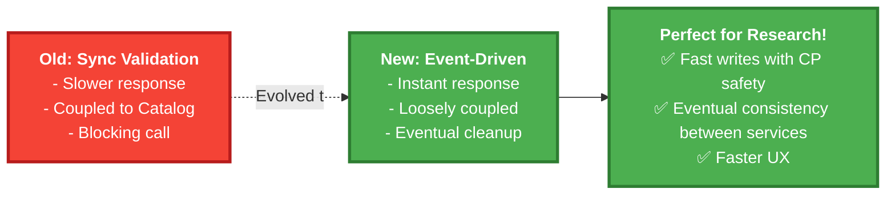
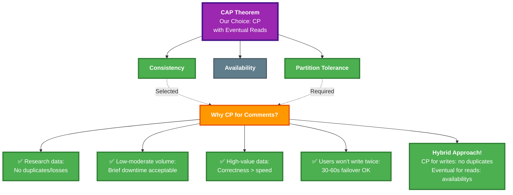
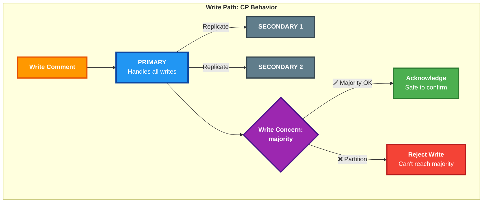
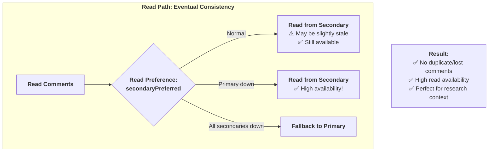
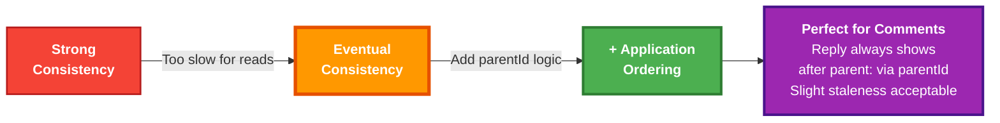
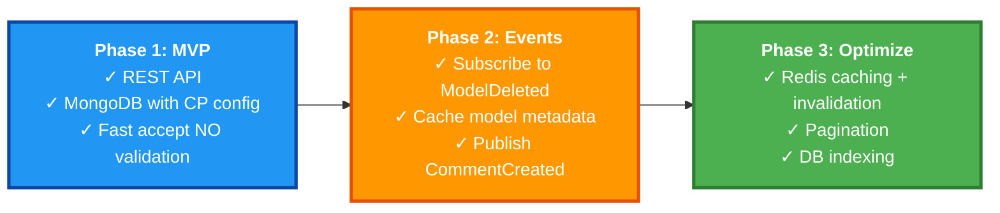
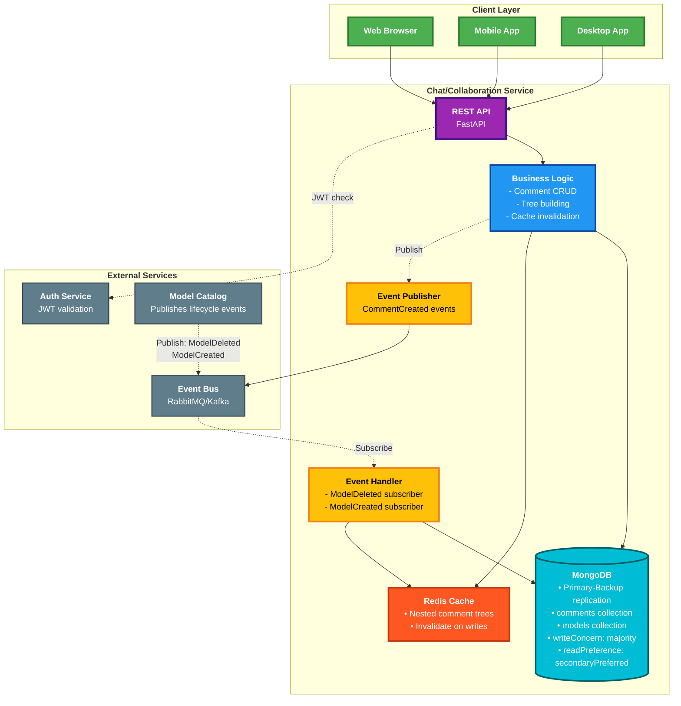

# Chat/Collaboration Service - Design Summary (Event-Driven Architecture)

## Core Responsibilities
- CRUD operations for comments on maze models
- Threaded conversations (replies to comments)
- Model creator badge distinction
- Event-driven cleanup and synchronization

---

## Technology Stack

| Component | Choice | Why? |
|-----------|--------|------|
| **API** | REST | Simple CRUD, browser-friendly, easy debugging |
| **Database** | MongoDB | - Flexible schema for nested comments <br> - Store models collection (from events) <br> - Primary-Backup replication for CP guarantees <br> - Eventual consistency for reads |
| **Cache** | Redis | Cache comment trees for fast reads, invalidate on writes  |
| **Events** | RabbitMQ/Kafka | - Async notifications <br> - Subscribe to model lifecycle events |


---

## Key API Endpoints

```
POST   /api/models/{modelId}/comments        # Create comment
GET    /api/models/{modelId}/comments        # Get nested comment tree
GET    /api/comments/{commentId}             # Get specific comment
PUT    /api/comments/{commentId}             # Update comment
DELETE /api/comments/{commentId}             # Delete comment
POST   /api/comments/{commentId}/replies     # Reply to comment
```


---

## Critical Design Decisions

### 1. Communication Patterns

**Optimistic Accept + Event-Driven Sync**
- **Fast Write Path**: 
  - Accept comments immediately (no validation blocking)
  - Trust frontend (model page already loaded = model exists)
  - REST with DB for instant CRUD operations
  
- **Asynchronous Synchronization**: 
  - Subscribe to Model Catalog events (ModelCreated, ModelDeleted)
  - Cache model metadata when events arrive
  - Clean up orphaned comments if model deleted
  - Publish CommentCreated events for notifications

**Why This Approach?**


### 2. CAP Choice: CP System with Eventual Read Consistency

**Context: Research Comments on Maze Designs**



**Justification:**

**Why CP over AP?**
1. **Research Context**: Comments on maze designs are valuable research data
2. **Low Volume**: Not a high-throughput system requiring extreme availability
3. **Data Integrity**: Duplicate or lost comments are unacceptable for research
4. **Correctness Priority**: Better to wait 30-60 seconds during failover than lose data
5. **User Expectations**: Researchers expect reliability over speed

**The Hybrid Approach:**






#### Consistency Model: Eventual with Application-Level Ordering




---

### 3. Data Sovereignty
**Own database** (microservices principle)
- Other services access comments ONLY via API
- Never share database
- Learn about models through events, not direct queries

---

## Implementation Phases



**Phase Details**:

**Phase 1 - MVP (Simplest)**:
- Accept comments immediately
- MongoDB with CP configuration (writeConcern: majority)
- Trust frontend (if user is on model page → model exists)
- No cross-service validation calls

**Phase 2 - Event-Driven Sync**:
- Subscribe to `ModelDeleted` events → Archive affected comments
- Subscribe to `ModelCreated` events → Cache creator info
- Publish `CommentCreated` events → Trigger notifications

**Phase 3 - Performance**:
1. **Redis caching with invalidation**: 
   - Cache comment trees (5-min TTL)
   - **Invalidate cache on write operations** (POST, PUT, DELETE)
   - Rebuild immediately after invalidation
2. **Pagination**: 50 comments per page
3. **DB indexing**: `(modelId, createdAt DESC)`

---

## Complete Service Architecture




