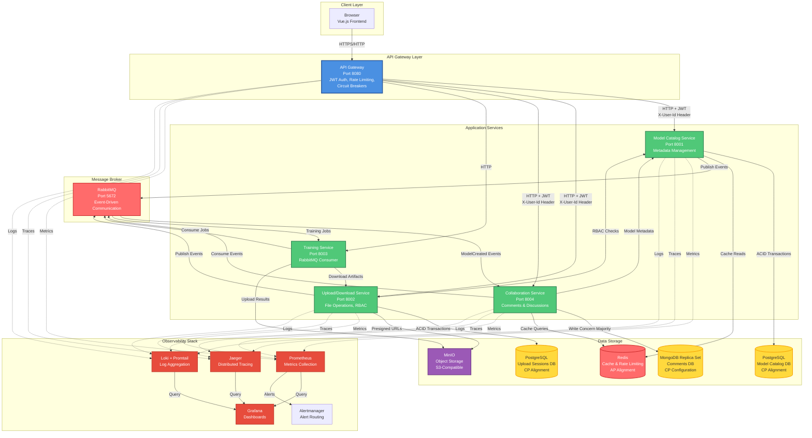

# RLLabs - Reinforcement Learning Collaboration Platform

A distributed microservices platform for collaborative reinforcement learning model development, training, and management. Built with FastAPI, Vue.js, PostgreSQL, MinIO, Redis, and Kubernetes for production-grade scalability.

---

## Table of Contents

- [Quick Start](#quick-start-setup-build-and-run)
  - [Prerequisites](#prerequisites)
  - [Setup and Build](#setup-and-build)
  - [Alternative: Kubernetes Deployment](#alternative-kubernetes-deployment)
- [Kubernetes Deployment](#kubernetes-deployment)
  - [Monitoring Endpoints](#monitoring-endpoints)
- [Running Tests](#running-tests)
- [Architecture Overview](#architecture-overview)
  - [Core Services](#core-services)
  - [Supporting Infrastructure](#supporting-infrastructure)
  - [Observability Stack](#observability-stack)
- [Integration](#integration)
- [API Usage](#api-usage)
  - [Generating a JWT Token](#generating-a-jwt-token)
  - [Creating a Model](#creating-a-model-via-gateway)
  - [Uploading/Downloading Artifacts](#uploading-a-model-file)
  - [Training Artifacts](#training-artifacts)
  - [Training Jobs](#triggering-a-training-job)
  - [Collaboration Service](#collaboration-service)
- [Distributed Systems Architecture](#distributed-systems-architecture)
  - [Communication Patterns](#communication-patterns)
  - [CAP Theorem Trade-offs](#cap-theorem-trade-offs)
  - [Fault Tolerance Mechanisms](#fault-tolerance-mechanisms)
  - [Security Architecture](#security-architecture)
  - [Data Consistency Strategies](#data-consistency-strategies)
  - [Performance](#performance)
  - [Scalability](#scalability)
- [Configuration](#configuration)
- [Performance Optimization](#performance-optimization)

---

## File Structure

```

rllabs/
├── api_gateway/              # API Gateway service (JWT auth, routing, rate limiting)
│   ├── config.py            # Service routing configuration
│   ├── jwt_auth.py          # JWT authentication logic
│   ├── main.py              # FastAPI application entry point
│   ├── proxy.py             # Request proxying logic
│   ├── rate_limiter.py      # Rate limiting implementation
│   └── Dockerfile
│
├── model_catalog_service/    # Model metadata management service
│   ├── cache.py             # Redis caching layer
│   ├── database.py          # PostgreSQL database models
│   ├── event_consumer.py    # RabbitMQ event consumer
│   ├── event_publisher.py    # RabbitMQ event publisher
│   ├── main.py              # FastAPI application
│   └── Dockerfile
│
├── upload_download_service/  # File upload/download service
│   ├── authorization.py     # RBAC authorization logic
│   ├── database.py          # PostgreSQL models for upload sessions
│   ├── event_publisher.py   # RabbitMQ event publishing
│   ├── main.py              # FastAPI application
│   ├── models.py            # Data models
│   ├── session_manager.py   # Upload session management
│   ├── storage.py           # MinIO/S3 storage operations
│   └── Dockerfile
│
├── model_train_service/      # Training job processing service
│   ├── agent.py             # DQN agent implementation
│   ├── main.py              # RabbitMQ consumer entry point
│   ├── model_brain.py       # Neural network model
│   ├── model_trainer.py     # Training orchestration
│   └── Dockerfile
│
├── collaboration_service/     # Comments and discussions service
│   ├── database.py          # MongoDB models
│   ├── dockerfile
│   ├── events.py            # RabbitMQ event consumer
│   ├── helpers.py           # Utility functions
│   ├── main.py              # FastAPI application
│   ├── schema.py            # Data schemas
│   └── requirements.txt
│
├── frontend/                 # Vue.js frontend application
│   ├── src/
│   │   ├── components/      # Vue components
│   │   ├── composables/     # Vue composables (auth, file upload)
│   │   ├── router/          # Vue Router configuration
│   │   ├── services/        # API service clients
│   │   └── views/           # Page views
│   ├── Dockerfile
│   └── Dockerfile.dev
│
├── shared/                   # Shared utilities across services
│   └── observability/       # OpenTelemetry tracing and logging
│       ├── logging.py
│       └── tracing.py
│
├── tests/                    # Test suite
│   ├── test_catalog_service.py
│   ├── test_collaboration_service.py
│   ├── test_gateway.py
│   ├── test_integration.py
│   ├── test_rbac_authorization.py
│   ├── test_training_flow.py
│   ├── test_upload_download_service.py
│   └── requirements.txt
│
├── kubernetes/               # Kubernetes manifests
│   ├── api-gateway.yml
│   ├── model-catalog-service.yml
│   ├── upload-download-service.yml
│   ├── collaboration-service.yml
│   ├── model-train-service.yml
│   ├── frontend.yml
│   ├── postgres-ha.yml      # PostgreSQL HA configuration
│   ├── redis-ha.yml         # Redis HA with Sentinel
│   ├── rabbitmq-ha.yml      # RabbitMQ cluster
│   ├── mongodb.yml          # MongoDB replica set
│   ├── minio.yml
│   ├── minio-ingress.yml
│   ├── ingress.yml
│   ├── hpa.yml              # Horizontal Pod Autoscaler
│   ├── prometheus.yml       # Metrics collection
│   ├── grafana.yml          # Dashboards
│   ├── jaeger.yml           # Distributed tracing
│   ├── loki.yml             # Log aggregation
│   └── alertmanager.yml     # Alerting
│
├── scripts/                  # Utility scripts
│   ├── start_everything.sh  # One-command Kubernetes deployment
│   ├── run_manual_tests.py # Manual integration tests
│   └── seed_database.py     # Database seeding
│
├── docker-compose.yml        # Docker Compose configuration
├── README.md                 # This file
├── OBSERVABILITY.md         # Observability guide
└── generate_token.py         # JWT token generation utility
└── kind-cluster-config.yml
└── sample_model.pth
└── training_config.json
└── dataset_config.json
└── upload_training_artifact.py 
```

---

## System Architecture



### Architecture Legend

- **Blue (API Gateway)**: Entry point, authentication, routing
- **Green (Application Services)**: Business logic services
- **Red (Message Broker)**: Asynchronous event communication
- **Yellow (Databases)**: Persistent data storage
- **Purple (Object Storage)**: File storage (MinIO)
- **Orange (Observability)**: Monitoring, logging, tracing

### Communication Patterns

- **Solid Lines**: Synchronous HTTP (request/response)
- **Dashed Lines**: Asynchronous events (RabbitMQ)
- **Dotted Lines**: Observability data (metrics, logs, traces)

---

## Quick Start: Setup, Build, and Run

### Prerequisites

**Required Dependencies:**

- **Docker** v20.10+ and **Docker Compose** v2.0+
- **Python 3.9+** (for running tests and token generation)
- **Node.js** v18+ and **npm** (for frontend development)

**Optional (for Kubernetes deployment):**

- **kubectl** (Kubernetes CLI)
- **Kind** (local Kubernetes cluster)

NOTE: See OBSERVABILITY.md

### Setup and Build

**1. Clone the repository:**

```bash
git clone https://github.com/niallgiblin/rllabs
cd rllabs
```

**2. Start all services (Docker Compose - Recommended for Quick Testing):**

```bash
docker compose up --build
```

This single command:

- Builds all Docker images
- Starts all services (Frontend, API Gateway, Model Catalog, Upload/Download, Training, Collaboration)
- Starts all infrastructure (PostgreSQL, MongoDB, Redis, RabbitMQ, MinIO)
- Frontend available at http://localhost:5173
- API Gateway available at http://localhost:8080

**3. Verify successful deployment:**

```bash
# Check API Gateway health
curl http://localhost:8080/health

# Check all services are running
docker compose ps

# View service logs
docker compose logs -f
```

### Alternative: Kubernetes Deployment

For Kubernetes deployment with full observability stack:

NOTE: see [OBSERVABILITY.md](OBSERVABILITY.md) for detailed guide on Kubernetes, scalability and metric observability.

```bash
# One-command setup (deploys everything)
./scripts/start_everything.sh

# Or manual deployment
kubectl apply -k kubernetes/
```

## Kubernetes Deployment

See `kubernetes/` for production manifests. Deploy with:

```bash
kubectl apply -k kubernetes
```

Services include ConfigMaps, Secrets, Deployments, Services, Ingress resources, and Observability stack deployment.

**Access the UIs:**

| Service      | Command                                               | URL                                 |
| ------------ | ----------------------------------------------------- | ----------------------------------- |
| Grafana      | `kubectl port-forward svc/grafana 3000:3000`        | http://localhost:3000 (admin/admin) |
| Jaeger       | `kubectl port-forward svc/jaeger-query 16686:16686` | http://localhost:16686              |
| Prometheus   | `kubectl port-forward svc/prometheus 9090:9090`     | http://localhost:9090               |
| Alertmanager | `kubectl port-forward svc/alertmanager 9093:9093`   | http://localhost:9093               |

**The Debugging Journey:**

1. **ALERT** fires → **WHAT** is wrong (Prometheus/Alertmanager)
2. Find **TRACE** → **WHERE** the problem is (Jaeger)
3. Query **LOGS** → **WHY** it failed (Loki via Grafana)

### Monitoring Endpoints

**Model Catalog Service:**

- `GET /cache/stats` - Cache hit rate statistics per endpoint
- `GET /database/pool-stats` - Connection pool usage (primary + replicas)
- `GET /models/{model_id}/diagnostics` - Model-specific diagnostics

### Running Tests

**Install test dependencies:**

```bash
pip install -r tests/requirements.txt
```

**Run all tests:**

```bash
pytest tests/ -v
```

Stop and Cleanup

```bash
# Stop all services
docker compose down

# Stop and remove volumes (clean slate)
docker compose down -v
```

---

## Architecture Overview

RLLabs is designed as a microservices architecture where specialised services handle different aspects of the ML lifecycle:

### Core Services

**Frontend (Vue.js)**

- Modern Vue 3 + Tailwind CSS v4 interface
- Interactive Model Catalog and Collaboration UI
- Runs on http://localhost:5173 (dev)

**API Gateway** (Port 8080)

- Single entry point for all client traffic
- JWT-based authentication and authorization
- **Public Catalog Browsing**: GET `/api/models*` endpoints are public (no auth required)
- **Protected Operations**: POST/PUT/DELETE operations require authentication
- Request routing, load balancing, and rate limiting
- **IP-Based Rate Limiting**: Unauthenticated users rate-limited by IP address
- User context propagation to backend services
- Health monitoring and service discovery
- **Fault Tolerance**: Circuit breakers, retry with exponential backoff
- **Graceful Degradation**: In-memory rate limiting when Redis unavailable
- **Enhanced Logging**: Tracks authenticated vs anonymous requests for monitoring

**Model Catalog Service** (Port 8001)

- Metadata management for ML models and versions
- PostgreSQL-backed model registration and versioning
- Query latest model versions and storage paths
- Created-by tracking for ownership
- **Public Browsing**: GET endpoints are accessible without authentication
- **Admin Delete**: Owners and admins can delete models (DELETE `/models/{model_id}`)
- **Event Publisher**: Publishes `ModelCreated` and `ModelDeleted` events to RabbitMQ
- **Version Registration**: Receives synchronous HTTP calls from Upload/Download Service for strong consistency (CP alignment)

**Upload/Download Service** (Port 8002)

- MinIO-backed model file operations
- Multipart uploads with presigned URLs (authentication required)
- **RBAC Authorization**:
  - **Public Downloads**: Unauthenticated users can download any artifact
  - **Authenticated Downloads**: Owner-based and model-level permission checks before presigned URL generation
  - **Uploads**: Authentication required (must be signed in to upload)
- Download with presigned URLs and authorization checks
- **Admin Delete**: Owners and admins can delete artifacts (DELETE `/artifacts/{artifact_id}`)
- Content-addressed storage (SHA-256 based deduplication)
- PostgreSQL metadata for artifacts and upload sessions
- **Version Registration**: Synchronous HTTP call to Model Catalog Service (strong consistency, CP alignment)
- **Event Publisher**: Publishes `ArtifactCommitted` and `ArtifactUploaded` events to RabbitMQ (for notifications only)
- **Security**: Authorization at application layer (before MinIO access) for secure + performant file transfers

**Training Service** (Port 8003)

- RabbitMQ consumer for training job processing
- Downloads training artifacts (configs, datasets, model weights) from MinIO
- Runs reinforcement learning training using PyTorch
- Uploads trained model weights back to MinIO as new model versions
- Integrated with Upload/Download Service for artifact management
- Automatic model versioning after training completion

**Collaboration Service** (Port 8004)

- Model comments and threaded discussions
- MongoDB replica set for CP (Consistency + Partition Tolerance) configuration
- Redis caching for comment queries
- Event-driven integration with Model Catalog (listens to ModelCreated/ModelDeleted events)
- Creator badge detection for comment authors
- Nested comment threads with pagination
- Automatic comment archiving when models are deleted

### Supporting Infrastructure

**PostgreSQL** (Port 5432)

- Primary database for Model Catalog metadata
- Stores model definitions, versions, and relationships

**MongoDB Replica Set** (Ports 27017/27018/27019)

- 3-node replica set (rs0) for Collaboration Service
- CP (Consistency + Partition Tolerance) configuration
- Write concern "majority" for consistency
- Read preference "secondary preferred" for high availability

**Redis** (Port 6379)

- Rate limiting and caching layer
- Session management and distributed locking
- Comment caching for Collaboration Service

**RabbitMQ** (Ports 5672/15672)

- Asynchronous event messaging between services
- Pub/sub for model lifecycle events
- Message queuing for background jobs
- Management UI for monitoring

**MinIO** (Ports 9000/9001)

- S3-compatible object storage
- Stores model files as artifacts
- Single bucket `rllabs-artifacts` for all model files

### Observability Stack

**Prometheus** (Port 9090)

- Metrics collection from all services
- Pre-configured scrape targets for all microservices
- Alerting rules for Four Golden Signals (Latency, Traffic, Errors, Saturation)
- 15-day retention with lifecycle management

**Grafana** (Port 3000)

- Unified dashboard for metrics, logs, and traces
- Pre-configured data sources: Prometheus, Loki, Jaeger, Alertmanager
- Custom RLLabs dashboard (`kubernetes/grafana-dashboard-rllabs.json`)

**Jaeger** (Port 16686)

- Distributed tracing backend
- Receives traces via OTLP (OpenTelemetry Protocol)
- Waterfall visualisation for request flows
- Service dependency graphs

**Loki + Promtail**

- Centralised log aggregation
- Promtail agents collect logs from all pods
- LogQL query language for structured log queries
- Trace ID correlation with Jaeger

**Alertmanager** (Port 9093)

- Alert routing and notification management
- Grouping, silencing, and inhibition rules
- Configurable receivers (e.g. Slack, email)

## Integration

- Gateway → Catalog authentication flow
- Gateway → Upload/Download Service authentication flow
- Gateway → Training Jobs endpoint (POST `/api/training-jobs`)
- Gateway → Collaboration Service (comments endpoints)
- **Public Catalog Browsing**: GET `/api/models*` endpoints are public (no auth required)
- **Protected Write Operations**: POST/PUT/DELETE operations require valid JWT
- Public routes (`/public/*`) open for discovery
- User ID propagation (`X-User-Id` header) to all backend services
- **Admin Scope Support**: JWT tokens with `api:admin` scope enable admin operations
- **RBAC Integration**: Cross-service permission checks (Upload/Download → Model Catalog)
- **Async Messaging**: Model and artifact lifecycle events via RabbitMQ
- **Training Job Flow**: Upload/Download Service → RabbitMQ → Training Service → MinIO → Model Catalog
- **Collaboration Flow**: Model Catalog → RabbitMQ → Collaboration Service (event-driven model metadata caching)
- **Synchronous Version Registration**: Artifact uploads trigger immediate version registration via HTTP (strong consistency)
- **Fault Tolerance**: Circuit breakers, retry with exponential backoff
- **Security**: Authorization at application layer, direct client-to-MinIO transfers for performance
- **IP-Based Rate Limiting**: Unauthenticated users rate-limited by IP address

**Ingress (Production-Ready Access):**

- **MinIO**: `http://minio.localhost` (API) and `http://minio-console.localhost` (Console)
- **API Gateway**: `http://api.localhost`
- **Security**: Ingress provides proper Kubernetes networking, TLS termination, and routing
- **Presigned URLs**: MinIO ingress enables direct client-to-storage transfers with proper authorization checks

**Manual Testing:**

- Both deployments support the same API endpoints through the API Gateway
- All manual tests from the README work identically in both environments
- Use `python3 scripts/run_manual_tests.py` to verify functionality in either environment
- The script automatically detects Docker Compose or Kubernetes and runs appropriate checks
- **All 14 tests passing**: Health checks, JWT tokens, model CRUD, uploads/downloads, training service, RabbitMQ connectivity, and more

### Running Tests

**Prerequisites:**
Ensure all services are running via Docker Compose:

```bash
docker compose up -d
```

**Test Dependencies:**
Install all test dependencies:

```bash
pip install -r tests/requirements.txt
```

**Test Architecture:**
All tests are integrated with the API Gateway and use JWT authentication. Tests route through `http://localhost:8080/api/*` endpoints, ensuring:

- Centralized authentication and authorization
- Consistent rate limiting
- Proper user context forwarding (`X-User-Id` header)
- Fault tolerance through circuit breakers
- End-to-end validation of the gateway integration

**Unit Tests (Catalog Service)**

```bash
pytest tests/test_catalog_service.py -v
```

Tests model CRUD operations, versioning, and error handling through the API Gateway:

- Model creation, retrieval, and deletion
- Version registration and latest version queries
- Ownership endpoint for RBAC checks
- Public browsing (no auth required for GET)
- Admin delete functionality
- All requests go through `/api/models` via gateway

**Gateway Tests**

```bash
pytest tests/test_gateway.py -v
```

Tests JWT authentication, protected routes, public routes, and rate limiting:

- Public catalog browsing (GET `/api/models*` without auth)
- Protected write operations (POST/DELETE require auth)
- IP-based rate limiting for unauthenticated users
- User-based rate limiting for authenticated users
- Token validation and error handling

**Integration Tests**

```bash
pytest tests/test_integration.py -v
```

Tests full workflows including:

- Gateway → Catalog communication
- JWT authentication flow
- RabbitMQ connectivity
- Event publishing (ModelCreated events)
- Graceful degradation when RabbitMQ is unavailable
- All API calls routed through gateway

**Upload/Download Service Tests**

```bash
pytest tests/test_upload_download_service.py -v
```

Tests Upload/Download Service integration through the gateway:

- Gateway routing for `/api/uploads` and `/api/downloads`
- JWT authentication enforcement (required for uploads, optional for downloads)
- User ID header forwarding (X-User-Id) from gateway
- Upload session creation, completion, and abortion
- Multipart upload with presigned URLs
- Content-addressed storage and deduplication
- **RBAC Authorization**:
  - Public downloads (no auth required - unauthenticated users can download any artifact)
  - Owner-based and model-level permission checks for authenticated users
  - Authenticated non-owners receive 403 Forbidden
- Download authorization and presigned URL generation
- RabbitMQ event publishing (ArtifactCommitted events)
- Graceful degradation when RabbitMQ is unavailable
- End-to-end upload workflow

**Training Flow Tests**

```bash
pytest tests/test_training_flow.py -v
```

Tests complete training workflow:

- Model creation via gateway
- Artifact uploads (config, dataset, weights)
- Training job triggering through gateway
- Training execution and monitoring
- Trained weights upload and version registration
- Download of trained models
- Multiple training runs (versioning)
- Error handling scenarios
- Model catalog queries

**RBAC Authorization Tests**

```bash
pytest tests/test_rbac_authorization.py -v
```

Tests comprehensive RBAC authorization through the gateway:

- Model Catalog ownership endpoint (via `/api/models/{id}/ownership`)
- Upload/Download Service authorization checks
- Owner access (positive cases)
- Non-owner denial (403 Forbidden) for authenticated users
- Public downloads (unauthenticated access allowed)
- Model-level permission checks
- Cross-service permission queries
- Error handling (404, 400, 401, 403)
- Edge cases and concurrent requests

**Collaboration Service Tests**

```bash
pytest tests/test_collaboration_service.py -v
```

Tests collaboration features through the gateway:

- Comment CRUD operations (via `/api/models/{id}/comments`)
- Nested comment threads
- Creator badge detection
- Event-driven integration (ModelCreated/ModelDeleted)
- Redis caching behavior
- Error handling scenarios
- API Gateway routing verification

**Admin Delete Tests**

```bash
# Model deletion tests
pytest tests/test_catalog_service.py::test_delete_model_* -v

# Artifact deletion tests
pytest tests/test_upload_download_service.py::test_delete_artifact_* -v
```

Tests admin and owner delete functionality:

- Owner can delete their models/artifacts
- Admin can delete any model/artifact (with `api:admin` scope)
- Non-owner non-admin cannot delete
- Error handling (404, 403, 401)

**RabbitMQ Event Testing**
The integration tests verify async messaging:

- `test_rabbitmq_connectivity`: Verifies RabbitMQ is accessible
- `test_model_created_event_published`: Tests ModelCreated event publishing
- `test_rabbitmq_artifact_event`: Tests ArtifactCommitted event publishing
- `test_rabbitmq_graceful_degradation`: Ensures services work without RabbitMQ

**Event Consumer Testing**

```bash
pytest tests/test_event_consumer.py -v
```

Tests event consumer functionality:

- Model Catalog receiving synchronous HTTP calls for version registration
- Auto-registration of model versions from artifact uploads
- Error handling and reconnection logic
- All model creation goes through gateway

**All Tests**

```bash
pytest tests/ -v
```

**Test Coverage Summary:**

- API Gateway: Authentication, routing, rate limiting
- Model Catalog: CRUD, versioning, ownership, events
- Upload/Download: Multipart uploads, RBAC, presigned URLs
- Training Service: End-to-end training workflow
- Collaboration Service: Comments, threads, events
- RBAC: Authorization across all services
- Integration: Cross-service workflows
- Event System: RabbitMQ messaging

## API Usage

### Generating a JWT Token

The platform uses Bearer JWT authentication. Use the provided token generation script:

```bash
# Regular user token
python generate_token.py

# Admin token (includes api:admin scope)
python generate_token.py --admin

# Custom user ID
python generate_token.py --user my-user-id

# Admin with custom user ID
python generate_token.py --admin --user admin-1

# Decode a token
python generate_token.py --decode <token>
```

### Creating a Model (via Gateway)

```bash
curl -X POST http://localhost:8080/api/models \
  -H "Authorization: Bearer YOUR_JWT_TOKEN" \
  -H "Content-Type: application/json" \
  -d '{
    "name": "my-rl-model",
    "description": "DQN agent for Atari"
  }'
```

Response:

```json
{
  "id": 1,
  "name": "my-rl-model",
  "description": "DQN agent for Atari",
  "created_by": "user-123"
}
```

### Registering a Model Version

```bash
curl -X POST http://localhost:8080/api/models/1/versions \
  -H "Authorization: Bearer YOUR_JWT_TOKEN" \
  -H "Content-Type: application/json" \
  -d '{
    "version": 1,
    "storage_path": "models/my-rl-model/v1.weights",
    "content_hash": "sha256:abc123..."
  }'
```

### Querying the Latest Version

```bash
curl http://localhost:8080/api/models/1/latest \
  -H "Authorization: Bearer YOUR_JWT_TOKEN"
```

Response:

```json
{
  "storage_path": "models/my-rl-model/v1.weights"
}
```

### Uploading a Model File

```bash
# Start upload session
# Note: Requires JSON body with file_hash (SHA-256 hash of file content)
curl -X POST http://localhost:8080/api/uploads \
  -H "Authorization: Bearer YOUR_JWT_TOKEN" \
  -H "Content-Type: application/json" \
  -d '{
    "filename": "model.weights",
    "file_size": 1048576,
    "file_hash": "sha256:abc123...",
    "chunk_size": 5242880,
    "artifact_type": "model",
    "model_id": 1
  }'
```

Response:

```json
{
  "upload_id": "uuid-here",
  "presigned_urls": [
    {
      "part_number": 1,
      "url": "https://presigned-url-for-part-1",
      "expires_at": "2024-01-01T12:00:00Z"
    }
  ],
  "session_expires_at": "2024-01-01T13:00:00Z"
}
```

After uploading parts to presigned URLs, complete the upload:

```bash
curl -X POST http://localhost:8080/api/uploads/{upload_id}/complete \
  -H "Authorization: Bearer YOUR_JWT_TOKEN" \
  -H "Content-Type: application/json" \
  -d '{
    "parts": [
      {
        "part_number": 1,
        "etag": "etag-from-upload-response"
      }
    ]
  }'
```

This triggers a synchronous HTTP call to Model Catalog Service to register the version immediately (strong consistency).

### Downloading an Artifact

**Public Downloads (No Authentication Required):**

```bash
# Public download (no auth required)
curl http://localhost:8080/api/downloads/{artifact_id}?expires_in=3600
```

**Authenticated Downloads (Optional):**

```bash
# Authenticated download (optional - same result as public)
curl http://localhost:8080/api/downloads/{artifact_id}?expires_in=3600 \
  -H "Authorization: Bearer YOUR_JWT_TOKEN"
```

**Authorization Rules:**

- **Public Access**: Unauthenticated users can download any artifact (public downloads enabled)
- **Authenticated Users**: If authenticated, service checks:
  1. If user is artifact owner (via upload session) - always allowed
  2. If artifact belongs to model, checks model-level permissions (queries Model Catalog)
  3. Returns 403 if unauthorized (for authenticated users), 404 if artifact not found
- **Flow**: Authorization check happens before presigned URL generation (secure + performant)

Response:

```json
{
  "download_url": "https://presigned-url-for-download",
  "expires_at": "2024-01-01T12:00:00Z",
  "file_size": 1048576,
  "filename": "model.weights"
}
```

**Error Responses:**

- `400 Bad Request`: Invalid artifact_id format
- `403 Forbidden`: Authenticated user does not have permission to download (public downloads are always allowed)
- `404 Not Found`: Artifact does not exist in system

### Deleting Models (Owner or Admin)

```bash
# Delete a model (owner or admin only)
curl -X DELETE http://localhost:8080/api/models/{model_id} \
  -H "Authorization: Bearer YOUR_JWT_TOKEN"
```

**Authorization:**

- Model owner can delete their models
- Admins (with `api:admin` scope) can delete any model
- Returns `403 Forbidden` if user is neither owner nor admin
- Returns `204 No Content` on success

### Deleting Artifacts (Owner or Admin)

```bash
# Delete an artifact (owner or admin only)
curl -X DELETE http://localhost:8080/api/artifacts/{artifact_id} \
  -H "Authorization: Bearer YOUR_JWT_TOKEN"
```

**Authorization:**

- Artifact owner can delete their artifacts
- Admins (with `api:admin` scope) can delete any artifact
- Returns `403 Forbidden` if user is neither owner nor admin
- Returns `404 Not Found` if artifact doesn't exist
- Returns `204 No Content` on success

**Note**: This is a hard delete - the artifact will be permanently removed from MinIO storage.

### Training Artifacts

Training jobs require three artifacts to be uploaded before submission:

1. **Training Config** (`training_config.json`) - DQN model architecture configuration
2. **Dataset Config** (`dataset_config.json`) - Maze/grid environment parameters
3. **Model Weights** (`sample_model.pth`) - Pre-trained PyTorch model weights

#### Training Config (`training_config.json`)

Defines the neural network architecture for the DQN agent:

```json
{
  "shape": [3, 10, 10],
  "layers": [
    {
      "type": "Conv2d",
      "in_channels": 3,
      "out_channels": 16,
      "kernel_size": 3,
      "padding": 1
    },
    {"type": "ReLU"},
    {"type": "Flatten"},
    {"type": "Linear", "out_features": 128},
    {"type": "ReLU"},
    {"type": "Linear", "out_features": 4}
  ]
}
```

**Fields:**

- `shape`: Input tensor shape `[channels, height, width]`
- `layers`: List of layer definitions (Conv2d, Linear, ReLU, Flatten)

#### Dataset Config (`dataset_config.json`)

Defines the maze/grid environment and training hyperparameters:

```json
{
  "grid_height": 10,
  "grid_width": 10,
  "channels": [[5, 5], [9, 9], [[0, 0], [1, 1], [2, 2]]],
  "initial_epsilon_value": 0.9,
  "initial_learning_rate": 0.001,
  "initial_gamma_value": 0.95
}
```

**Fields:**

- `grid_height`, `grid_width`: Maze dimensions
- `channels`: Channel positions for maze features
- `initial_epsilon_value`: Exploration rate (ε-greedy)
- `initial_learning_rate`: Learning rate for optimizer
- `initial_gamma_value`: Discount factor (γ)

#### Model Weights (`sample_model.pth`)

Pre-trained PyTorch model weights matching the training config architecture. The repository includes a sample weights file, or you can generate one:

```bash
# Generate sample weights matching training_config.json
python create_sample_weights.py
```

This creates `sample_model.pth` with a Sequential architecture matching the training config.

#### Uploading Training Artifacts

Use the `upload_training_artifact.py` utility script to upload artifacts through the API Gateway:

```bash
# Set JWT token (required for authentication)
export JWT_TOKEN=$(python generate_token.py)

# Upload training config
python upload_training_artifact.py training_config.json --model-id 1 --type config

# Upload dataset config
python upload_training_artifact.py dataset_config.json --model-id 1 --type dataset

# Upload model weights
python upload_training_artifact.py sample_model.pth --model-id 1 --type model
```

**Script Features:**

- Automatically handles JWT authentication (uses `generate_token.py` if no token provided)
- Supports multipart uploads for large files
- Auto-detects MinIO endpoint (Docker Compose vs Kubernetes)
- Returns artifact IDs for use in training job submission

**Manual Upload Alternative:**

You can also upload artifacts using the API directly (see "Uploading a Model File" section). Make note of the `artifact_id` (SHA-256 hash) returned for each upload.

### Triggering a Training Job

Training jobs are triggered by uploading the required artifacts (config, dataset, model weights) and then submitting a training job request.

**Step 1: Upload Training Artifacts**

Upload the three required artifacts using `upload_training_artifact.py` or the API:

```bash
# Using the utility script (recommended)
python upload_training_artifact.py training_config.json --model-id 1 --type config
python upload_training_artifact.py dataset_config.json --model-id 1 --type dataset
python upload_training_artifact.py sample_model.pth --model-id 1 --type model
```

Make note of the `artifact_id` (SHA-256 hash) returned for each upload.

**Step 2: Trigger Training Job**

```bash
curl -X POST http://localhost:8080/api/training-jobs \
  -H "Authorization: Bearer YOUR_JWT_TOKEN" \
  -H "Content-Type: application/json" \
  -d '{
    "config_artifact_id": "sha256:abc123...",
    "dataset_artifact_id": "sha256:def456...",
    "model_artifact_id": "sha256:ghi789..."
  }'
```

Response:

```json
{
  "job_id": "job-uuid-here",
  "status": "queued",
  "message": "Training job has been queued for processing"
}
```

**Training Flow:**

1. Upload/Download Service validates all artifacts exist
2. Service queries database to get `model_id` from model artifact
3. Service publishes job message to RabbitMQ `training_jobs` queue
4. Training Service consumes message and downloads artifacts
5. Training Service runs training with Agent
6. Training Service saves trained weights and uploads to MinIO
7. New model version is automatically registered in Model Catalog

**Monitoring Training Jobs:**

```bash
# Check Training Service logs
docker compose logs -f model-train-service

# Check RabbitMQ queue
# Docker Compose:
curl -u admin:admin_password http://localhost:15672/api/queues/%2F/training_jobs

# Kubernetes/Kind (requires port-forward):
# kubectl port-forward service/rabbitmq 15672:15672
# Then: curl -u admin:admin_password http://localhost:15672/api/queues/%2F/training_jobs

# View training progress in logs
docker compose logs model-train-service | grep "Training job"
```

**After Training Completes:**

The trained model weights are automatically uploaded and registered as a new version. You can query the model versions:

```bash
# List all versions for a model
curl http://localhost:8080/api/models/{model_id}/versions

# Get latest version (should be the newly trained one)
curl http://localhost:8080/api/models/{model_id}/latest
```

### Collaboration Service

**Create a Comment on a Model:**

```bash
curl -X POST http://localhost:8080/api/models/{model_id}/comments \
  -H "Authorization: Bearer YOUR_JWT_TOKEN" \
  -H "Content-Type: application/json" \
  -d '{
    "content": "Great model! How did you tune the hyperparameters?",
    "authorId": "user-123",
    "authorName": "Alice",
    "parentId": null
  }'
```

Response:

```json
{
  "id": "507f1f77bcf86cd799439011",
  "modelId": "1",
  "content": "Great model! How did you tune the hyperparameters?",
  "authorId": "user-123",
  "authorName": "Alice",
  "isCreator": false,
  "parentId": null,
  "createdAt": "2024-01-01T12:00:00Z",
  "updatedAt": "2024-01-01T12:00:00Z",
  "replies": []
}
```

**Reply to a Comment:**

```bash
curl -X POST http://localhost:8080/api/models/{model_id}/comments \
  -H "Authorization: Bearer YOUR_JWT_TOKEN" \
  -H "Content-Type: application/json" \
  -d '{
    "content": "I used grid search with learning rate 0.001",
    "authorId": "user-456",
    "authorName": "Bob",
    "parentId": "507f1f77bcf86cd799439011"
  }'
```

**Get Comments for a Model:**

```bash
# Get paginated comments (nested tree structure)
curl http://localhost:8080/api/models/{model_id}/comments?page=1&limit=50
```

Response:

```json
{
  "data": [
    {
      "id": "507f1f77bcf86cd799439011",
      "content": "Great model!",
      "authorId": "user-123",
      "authorName": "Alice",
      "isCreator": false,
      "replies": [
        {
          "id": "507f1f77bcf86cd799439012",
          "content": "I used grid search...",
          "authorId": "user-456",
          "authorName": "Bob",
          "replies": []
        }
      ]
    }
  ],
  "pagination": {
    "page": 1,
    "limit": 50,
    "total": 1,
    "hasMore": false
  }
}
```

**Update a Comment:**

```bash
curl -X PUT http://localhost:8080/api/comments/{comment_id} \
  -H "Authorization: Bearer YOUR_JWT_TOKEN" \
  -H "Content-Type: application/json" \
  -d '{
    "content": "Updated comment content"
  }'
```

**Delete a Comment (and all replies):**

```bash
curl -X DELETE http://localhost:8080/api/comments/{comment_id} \
  -H "Authorization: Bearer YOUR_JWT_TOKEN"
```

**Features:**

- Nested comment threads (replies to replies)
- Creator badge detection (automatically marks model creator's comments)
- Automatic comment archiving when models are deleted
- Redis caching (5-minute TTL) for performance
- Pagination on top-level comments

### Public Model Discovery

**Browse models without authentication:**

```bash
# List all models (public endpoint)
curl http://localhost:8080/api/models

# Get model details (public endpoint)
curl http://localhost:8080/api/models/1

# Get latest version path (public endpoint)
curl http://localhost:8080/api/models/1/latest
```

All GET `/api/models*` endpoints are public (no authentication required). This enables easy model discovery and browsing.

**Note**: Write operations (POST/PUT/DELETE) still require authentication.

### Testing RabbitMQ Events

**Verify RabbitMQ is running:**

**Docker Compose:**

RabbitMQ management UI is not exposed by default. To access it, you can either:

**Option 1: Add port mapping to docker-compose.yml** (add to rabbitmq service):

```yaml
ports:
  - "15672:15672"  # Management UI
  - "5672:5672"    # AMQP port (optional, for external access)
```

**Option 2: Access via Docker exec:**

```bash
# Check RabbitMQ status
docker compose exec rabbitmq_messaging rabbitmq-diagnostics status

# List queues
docker compose exec rabbitmq_messaging rabbitmqctl list_queues
```

**Option 3: Access management UI from within container:**

```bash
# Start a temporary container on the same network
docker run -it --rm --network rllabs_rllabs-network curlimages/curl:latest \
  curl -u admin:admin_password http://rabbitmq_messaging:15672/api/overview
```

**Kubernetes/Kind:**

```bash
# Set up port-forward for RabbitMQ management UI
kubectl port-forward service/rabbitmq 15672:15672

# Then in another terminal:
curl -u admin:admin_password http://localhost:15672/api/overview
```

**View events via Management UI:**

**Docker Compose (if ports are exposed):**

1. Open http://localhost:15672 in your browser
2. Login with `admin` / `admin_password`
3. Navigate to **Exchanges** → `model_events` or `artifact_events`
4. Check **Bindings** to see queue subscriptions
5. Monitor published messages in real-time

**Kubernetes/Kind:**

1. Set up port-forward: `kubectl port-forward service/rabbitmq 15672:15672`
2. Open http://localhost:15672 in your browser
3. Login with `admin` / `admin_password`
4. Navigate to **Exchanges** → `model_events` or `artifact_events`
5. Check **Bindings** to see queue subscriptions
6. Monitor published messages in real-time

**Monitoring events in tests:**

Integration tests automatically verify event publishing. See `tests/test_integration.py`:

- `test_rabbitmq_connectivity`: Verifies RabbitMQ is accessible
- `test_model_created_event_published`: Tests ModelCreated event flow
- `test_rabbitmq_graceful_degradation`: Ensures services work without RabbitMQ
- `test_rabbitmq_artifact_event`: Tests ArtifactCommitted event flow

## Distributed Systems Architecture

### Communication Patterns

**Synchronous HTTP (Request/Response)**

- **API Gateway → Backend Services**: Synchronous HTTP with JWT validation
- **Upload/Download → Model Catalog**: Synchronous HTTP for RBAC permission checks
- **Trade-off**: Strong consistency, but tight coupling and potential latency
- **Use Case**: Critical operations requiring immediate consistency (model creation, permission checks)

**Asynchronous Messaging (Event-Driven)**

- **Services → RabbitMQ**: Event publishing for non-critical operations
- **RabbitMQ → Event Consumers**: Async processing of model/artifact lifecycle events (notifications only, NOT for version registration)
- **Trade-off**: Loose coupling and scalability, but eventual consistency
- **Use Case**: Non-blocking operations (event notifications, auto-registration)

**Direct Client-to-Storage (Presigned URLs)**

- **Client → MinIO**: Direct file transfers bypassing backend services
- **Trade-off**: High performance (no backend bottleneck), but requires pre-authorization
- **Use Case**: Large file uploads/downloads (GB-scale model files)

### CAP Theorem Trade-offs

**Consistency vs Availability vs Partition Tolerance**

| Service                   | Primary Choice                                    | Rationale                                                                                                       |
| ------------------------- | ------------------------------------------------- | --------------------------------------------------------------------------------------------------------------- |
| **Model Catalog**   | **CP** (Consistency + Partition Tolerance)  | Model metadata must be consistent. If database is partitioned, we prefer to fail rather than serve stale data.  |
| **Upload/Download** | **CP** (Consistency + Partition Tolerance)  | Artifact metadata must be consistent. Authorization checks require consistent data.                             |
| **API Gateway**     | **AP** (Availability + Partition Tolerance) | Gateway should remain available even if backend services are down. Uses circuit breakers to degrade gracefully. |
| **RabbitMQ Events** | **AP** (Availability + Partition Tolerance) | Events are eventually consistent. System continues operating even if message broker is partitioned.             |

**Key Decisions:**

- **Strong Consistency for Metadata**: Model and artifact ownership must be consistent across services
- **Eventual Consistency for Events**: Model lifecycle events can be processed asynchronously
- **Graceful Degradation**: Services continue operating with reduced functionality when dependencies fail

### Fault Tolerance Mechanisms

**Circuit Breakers** (API Gateway)

- Prevents cascading failures when backend services are down
- Opens circuit after failure threshold, allows retry after cooldown
- **Trade-off**: Fast failure detection, but may block legitimate requests during recovery

**Retry with Exponential Backoff** (API Gateway)

- Automatic retry for transient failures
- Exponential backoff prevents overwhelming failing services
- **Trade-off**: Improves reliability, but increases latency for failed requests

**Rate Limiting** (API Gateway)

- **Authenticated Users**: Rate limited by user ID (Redis-backed)
- **Unauthenticated Users**: Rate limited by IP address (Redis-backed)
- **Graceful Degradation**: Falls back to in-memory rate limiting if Redis unavailable
- **Trade-off**: Prevents abuse, but may block legitimate users during high traffic

**Graceful Degradation**

- **RabbitMQ Unavailable**: Services continue operating, events are skipped (logged)
- **Redis Unavailable**: Gateway falls back to in-memory rate limiting
- **Model Catalog Unavailable**: Upload/Download Service fails authorization checks (fail-closed security)
- **Trade-off**: System remains operational, but with reduced functionality

**Health Checks and Monitoring**

- Each service exposes `/health` endpoint
- Docker Compose health checks ensure services are ready before routing traffic
- **Trade-off**: Adds overhead, but enables automatic recovery and load balancing

### Security Architecture

**Authentication** (API Gateway)

- JWT-based authentication at gateway layer
- User context (`X-User-Id`) propagated to all backend services
- **Trade-off**: Centralized auth simplifies backend, but gateway becomes single point of failure

**Authorization** (Application Layer)

- **RBAC at Service Level**: Authorization checks in Upload/Download Service before generating presigned URLs
- **Public Downloads**: Unauthenticated users can download any artifact (no auth required)
- **Authenticated Downloads**: Owner-based and model-level permission checks for authenticated users
- **Upload Authentication**: All uploads require authentication (must be signed in)
- **Cross-Service Permission Checks**: Upload/Download queries Model Catalog for model ownership
- **Admin Scope**: JWT tokens with `api:admin` scope enable admin operations (delete models/artifacts)
- **Owner or Admin**: Both owners and admins can delete resources
- **Fail-Closed Security**: Deny access on errors (secure by default)
- **Trade-off**: Authorization in application layer (where business logic exists) vs. storage layer (simpler but less flexible)

**Direct Storage Access** (Presigned URLs)

- Clients upload/download directly to/from MinIO (bypasses backend)
- Authorization happens before URL generation (secure)
- **Trade-off**: High performance (no backend bottleneck) + Security (authorization before access)

### Data Consistency Strategies

**Strong Consistency** (PostgreSQL)

- Model metadata: ACID transactions ensure consistency
- Artifact ownership: Database transactions ensure upload sessions are atomic
- **Trade-off**: Strong consistency requires synchronous operations (higher latency)

**Eventual Consistency** (RabbitMQ Events)

- Model lifecycle events: Processed asynchronously (notifications only)
- **Note**: Version registration uses synchronous HTTP for strong consistency, NOT events
- **Trade-off**: Eventual consistency allows high throughput for notifications, but version registration requires immediate consistency

**Idempotency** (Redis + Database)

- Upload deduplication: Redis idempotency keys prevent duplicate uploads
- Database unique constraints: Prevent duplicate model versions
- **Trade-off**: Idempotency improves reliability, but requires additional storage

### Performance

**Content-Addressed Storage**

- Artifacts stored by SHA-256 hash (deduplication)
- **Trade-off**: Storage efficiency vs. hash computation overhead

**Presigned URLs**

- Direct client-to-MinIO transfers (bypasses backend)
- **Trade-off**: High performance vs. time-limited URLs (security)

**Database Indexing**

- Indexed on `user_id`, `model_id`, `file_hash` for fast authorization checks
- **Trade-off**: Fast queries vs. write performance overhead

### Scalability

**Horizontal Scaling**

- Stateless services (API Gateway, Model Catalog, Upload/Download) can scale horizontally
- Database (PostgreSQL) requires replication for read scaling
- **Trade-off**: Horizontal scaling improves availability, but requires distributed coordination

**Vertical Scaling**

- MinIO can scale vertically (larger storage)
- PostgreSQL can scale vertically (more memory/CPU)
- **Trade-off**: Vertical scaling is simpler, but has hardware limits

**Current Limitations**

- Single MinIO instance (no distributed mode)
- **Future Enhancements**: Read replicas, distributed MinIO, service mesh for inter-service communication

**Accessing Infrastructure Services for Debugging:**

**Docker Compose:**

- Infrastructure services (PostgreSQL, Redis, RabbitMQ, MongoDB) are **not exposed** to the host network for security
- Use `docker compose exec` to access services:

  ```bash
  # PostgreSQL
  docker compose exec postgres_db psql -U rllabs -d model_catalog_db

  # Redis
  docker compose exec redis_cache redis-cli

  # RabbitMQ (CLI)
  docker compose exec rabbitmq_messaging rabbitmq-diagnostics status
  docker compose exec rabbitmq_messaging rabbitmqctl list_queues

  # MongoDB
  docker compose exec mongo1 mongosh --port 27017
  ```
- **MinIO** remains exposed at http://localhost:9000 (required for presigned URLs)

**Kubernetes/Kind:**

- Infrastructure services use ClusterIP (internal only)
- **MinIO**: Uses ingress (`http://minio.localhost`) - no port-forward needed for presigned URLs
- Use `kubectl port-forward` for temporary access to other infrastructure services:
  ```bash
  # PostgreSQL
  kubectl port-forward svc/postgres-primary 5432:5432

  # Redis
  kubectl port-forward svc/redis 6379:6379

  # RabbitMQ Management UI
  kubectl port-forward svc/rabbitmq 15672:15672
  # Then access: http://localhost:15672 (admin/admin_password)

  # MongoDB
  kubectl port-forward svc/mongodb 27017:27017
  ```
- Or use `kubectl exec` for direct access:
  ```bash
  kubectl exec -it postgres-primary-0 -- psql -U rllabs -d model_catalog_db
  kubectl exec -it redis-master-0 -- redis-cli
  ```

## Configuration

### Environment Variables

**API Gateway**

- `SECRET_KEY`: JWT signing secret
- `REDIS_HOST`: Redis connection host
- `REDIS_PORT`: Redis port
- `RATE_LIMIT_REQUESTS`: Max requests per window (default: 100)
- `RATE_LIMIT_WINDOW`: Time window in seconds (default: 60)

**Model Catalog Service**

- `DATABASE_URL`: PostgreSQL connection string
- `REDIS_HOST`: Redis host for caching
- `RABBITMQ_HOST`: RabbitMQ connection host
- `RABBITMQ_PORT`: RabbitMQ port
- `RABBITMQ_USER`: RabbitMQ username
- `RABBITMQ_PASS`: RabbitMQ password

**Upload/Download Service**

- `DATABASE_URL`: PostgreSQL connection string (separate database: `upload_download_db`)
- `MINIO_ENDPOINT`: MinIO endpoint URL
- `MINIO_ACCESS_KEY`: MinIO access key
- `MINIO_SECRET_KEY`: MinIO secret key
- `MINIO_BUCKET`: MinIO bucket name (`models`)
- `MINIO_USE_SSL`: Whether to use SSL (false for local MinIO)
- `MODEL_CATALOG_URL`: Model Catalog Service URL for RBAC permission checks
- `RABBITMQ_HOST`: RabbitMQ connection host
- `RABBITMQ_PORT`: RabbitMQ port
- `RABBITMQ_USER`: RabbitMQ username
- `RABBITMQ_PASS`: RabbitMQ password
- `REDIS_HOST`: Redis host for idempotency
- `REDIS_PORT`: Redis port

**Training Service**

- `UPLOAD_DOWNLOAD_SERVICE_URL`: Upload/Download Service URL (default: `http://upload-download-service:8002`)
- `RABBITMQ_HOST`: RabbitMQ connection host (default: `rabbitmq`)
- `RABBITMQ_PORT`: RabbitMQ port (default: `5672`)
- `RABBITMQ_USER`: RabbitMQ username (default: `admin`)
- `RABBITMQ_PASS`: RabbitMQ password (default: `admin_password`)
- `RABBITMQ_QUEUE`: Queue name for training jobs (default: `training_jobs`)
- `NUM_EPISODES`: Number of training episodes (default: `50`)

**Collaboration Service**

- `MONGO_URI`: MongoDB connection string with replica set (default: `mongodb://mongo1:27017,mongo2:27018,mongo3:27019/?replicaSet=rs0`)
- `REDIS_HOST`: Redis host for caching (default: `redis`)
- `REDIS_PORT`: Redis port (default: `6379`)
- `RABBITMQ_HOST`: RabbitMQ connection host (default: `rabbitmq`)
- `RABBITMQ_PORT`: RabbitMQ port (default: `5672`)
- `RABBITMQ_USER`: RabbitMQ username (default: `admin`)
- `RABBITMQ_PASS`: RabbitMQ password (default: `admin_password`)
- `MODEL_CATALOG_URL`: Model Catalog Service URL for fallback queries (default: `http://model-catalog-service:8000`)

**Observability (All Services)**

- `OTEL_SERVICE_NAME`: Service name for traces (e.g., `api-gateway`)
- `OTEL_EXPORTER_OTLP_ENDPOINT`: Jaeger OTLP endpoint (default: `http://jaeger:4317`)
- `TRACING_ENABLED`: Enable/disable distributed tracing (default: `true`)
- `LOG_LEVEL`: Logging level (default: `INFO`)

**MongoDB**

- Replica set `rs0` with 3 nodes (mongo1, mongo2, mongo3)
- Automatic replica set initialization on startup
- CP (Consistency + Partition Tolerance) configuration

**MinIO**

- `MINIO_ROOT_USER`: Admin username
- `MINIO_ROOT_PASSWORD`: Admin password

See `docker-compose.yml` for full configuration.

## Performance Optimization

**PostgreSQL Configuration:**

- `work_mem`: 16MB (prevents disk spills for complex queries)
- `maintenance_work_mem`: 128MB (faster VACUUM/INDEX operations)
- `shared_buffers`: 256MB (25% of memory, improved caching)
- `effective_cache_size`: 768MB (75% of memory, better query planning)
- Read replicas configured with same performance parameters
- `max_connections`: 300 (supports 3 pods × 75 connections each)

**Redis Configuration:**

- `maxmemory`: 100mb (master), 50mb (replicas) - prevents OOM kills
- `maxmemory-policy`: allkeys-lru - evicts least recently used keys
- `maxclients`: 10000 - explicit connection limit
- High availability: Master + 2 replicas + 3 Sentinels

**MinIO Configuration:**

- CPU limits: 1000m (increased from 500m for erasure coding)
- CPU requests: 200m (increased from 100m)
- 4-node distributed deployment (erasure coding for redundancy)
