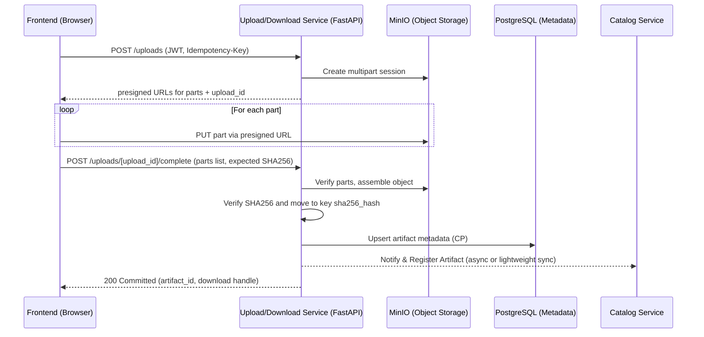

# Upload/Download Service — Design Summary (Direct-to-Object Storage + CP Metadata)

## Core Responsibilities

* **Secure artifact ingestion (uploads)** with resumable, multipart uploads and client → storage short-lived presigned URLs.

  * Orchestrate sessions, generate presigned part URLs, verify final SHA-256, and commit to permanent, content-addressed storage keys for deduplication.
* **Secure artifact delivery (downloads)** by checking RBAC and issuing short-lived presigned GET URLs so browsers fetch bytes directly from storage.
* **Metadata management** (PostgreSQL): persist artifacts (hash, size, MIME, owner, provenance), upload sessions, and integrity results.
* **Integration with Model Catalog / Environment registry** so new artifacts (models, environments) appear in the platform.
* **Operational safety**: idempotency on writes, rate limits, resumability, and safe abort/cleanup paths.


## 2) Technology Stack

| Component                     | Choice                      | Why (Trade-offs)                                                                                                       |
| ----------------------------- | --------------------------- | ---------------------------------------------------------------------------------------------------------------------- |
| **Language / Framework**      | Python + FastAPI on Uvicorn | Async I/O, excellent DX, straightforward REST; Python aligns with RL tooling.                                          |
| **Object Storage**            | MinIO (S3-compatible)       | Cheap, scalable blob storage; presigned URLs enable direct browser uploads/downloads, reducing service egress and CPU. |
| **DB (metadata)**             | PostgreSQL                  | Strong consistency for critical metadata and commit semantics.                                                         |
| **Async S3 client**           | `aioboto3`                  | Async multipart orchestration to MinIO from FastAPI.                                                                   |
| **Cache / Control**           | Redis                       | Idempotency keys and rate limiting to tame retries and client churn.                                                   |
| **Container / Orchestration** | Docker + Kubernetes         | Aligns with module requirements on cloud-native deployment, scaling and resilience.                                    |


## 3) Key API Endpoints

```http
# Uploads
POST   /uploads
# → Start multipart: returns upload_id and presigned part URLs

POST   /uploads/{upload_id}/complete
# → Server verifies SHA-256, commits to permanent key, records metadata

POST   /uploads/{upload_id}/abort
# → Abort multipart, cleanup temp parts and session state

# Downloads
GET    /downloads/{artifact_id}
# → Enforce RBAC, return short-lived presigned GET URL (browser pulls directly)
```

**Auth & governance notes**

* All endpoints require **JWT** (validated by API Gateway/Auth svc).
* **Idempotency-Key** header supported on `POST /uploads` and `.../complete` to prevent duplicate commits (Redis).


##  Critical Design Decisions (with Trade-offs)

### 1. **Direct-to-Storage via Presigned URLs (Browser ↔ MinIO)**

**Decision:** Service issues short-lived presigned URLs; clients upload/download bytes directly.
**Why:** Offloads bandwidth/CPU from service; enables high throughput and large files; simple browser integration.
**Trade-offs:**

* ✅ Scales cheaply (service handles control-plane only).
* ✅ Lower latency and egress from app pods.
* ⚠️ Requires careful **integrity verification** (final SHA-256) and **secure URL TTLs**.
* ⚠️ More moving parts in error handling/resume logic.

### 2. **Content-Addressed Storage + Dedup**

**Decision:** On `complete`, move object to key = `sha256/<hash>` and record metadata row.
**Why:** Eliminates duplicates, simplifies immutability and cacheability, eases lineage tracking for RL experiments.
**Trade-offs:**

* ✅ Storage savings and consistent caching.
* ⚠️ Requires hash computation and strict verification path.

### 3. **Communication Patterns**

* **Sync REST** for control-plane (session start/complete/abort, RBAC checks), simple and debuggable.
* **Async integration** to the Catalog/Env side: emit an “ArtifactCommitted” event (or perform a lightweight sync call) to register the artifact for discovery in UI. This keeps Upload/Download loosely coupled with Catalog changes. **Trade-off:** async means brief discovery lag; sync is tighter but couples availability.

### 4. **Distributed Transactions as a Saga**

Upload completion spans **MinIO** and **PostgreSQL** (and optionally Catalog). We use a **Saga** with compensations:

1. **Try:** Verify all parts exist in MinIO; compute/verify SHA-256; write metadata row; (optionally) notify Catalog.
2. **Compensate on failure:**

   * Delete temporary multipart/uploaded parts in MinIO.
   * Remove/rollback metadata row.
   * Emit “ArtifactFailed” for observers.
     **Trade-offs:**

* ✅ Avoids two-phase commit across heterogeneous systems.
* ⚠️ Requires idempotent handlers and careful retry semantics (Redis).

### 5. **Resilience & Observability**

* **Idempotency keys** (Redis) for all write paths; **at-least-once** client retries with **exponential backoff**.
* **Timeouts** and **circuit breakers** on storage and DB calls; **rate-limit** abusive clients.
* **Structured logs**, per-request **correlation IDs**, metrics (latency, error rates, URL-issuance counts), and **traces** (OpenTelemetry) spanning gateway → service → MinIO/DB.
  These choices align with course expectations on fault tolerance and clear, observable systems.

### 6. **Security Posture**

* **Short-lived presigned URLs** (seconds-to-minutes TTL), scoped to exact bucket/object/part and method; server-side **RBAC** before URL issuance.
* **Zero-trust** between services via API Gateway + mTLS (cluster) and strict IAM for MinIO.
* **Content-type sniffing** and size limits to prevent abuse; **WAF** at the edge recommended.


##  CAP Choice (Hybrid per Responsibility)

**Summary:**

* **Metadata path (PostgreSQL): choose *CP*** — correctness of artifact metadata and commit state is paramount. We require atomic “committed or not” semantics on `complete`, even if that means rejecting writes during partitions (majority unavailability).
* **Blob path (MinIO/S3-API): effectively *AP* behavior** — object storage emphasizes availability; clients can upload parts and later reconcile. Slight staleness in listings is tolerable because **the service’s metadata** is the source of truth for artifact visibility.

**Why this “least-worst” mix for RLLabs:**

* RL workflows value **reproducibility** and **traceability** of artifacts over always-write-availability to metadata. A corrupted or ambiguous commit costs more than a brief write outage.
* Direct-to-storage keeps the byte path highly available and horizontally scalable; **commit** only happens when metadata is durably written, preserving integrity and dedup guarantees.


## Appendix: Upload Sequence (Happy Path)




### How this supports the module’s learning goals

* **Architecture styles & trade-offs:** Control-plane microservice, direct-to-storage data plane, and hybrid CAP per concern, each justified by cost/scale/availability impacts.
* **Sync vs async:** REST for control; async notification to Catalog to decouple availability and limit blast radius.
* **Data architectures:** Content-addressed blobs + CP metadata model; dedup and immutable artifact history to aid reproducible RL.
* **Distributed transactions & Sagas:** Cross-system commit with compensations instead of 2PC.
* **Resilience & observability:** Idempotency, retries, rate-limits, tracing/metrics/logs; aligns with rubric emphasis on fault tolerance and clear justification.

---

### Appendix: Endpoint Snapshot

```
POST   /uploads
POST   /uploads/{upload_id}/complete
POST   /uploads/{upload_id}/abort
GET    /downloads/{artifact_id}
```
